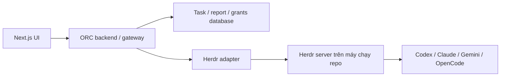
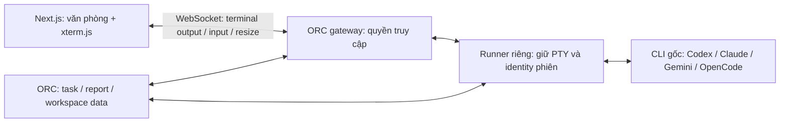

# Đánh giá Herdr cho ORC

Ngày kiểm tra: 2026-10-08. Binary cục bộ: Herdr 0.9.3. Đây là đề xuất backend, chưa tích hợp hoặc thử điều khiển phiên thật. Codex hiện không chạy trong Herdr (`HERDR_ENV` không bằng1), vì vậy chỉ đọc help/version và tài liệu.

## Kết luận

Khả thi: dùng Herdr quản lý terminal/process và một adapter ORC nhỏ để điều phối. Giảm công việc tự xây PTY, giữ phiên qua mất kết nối, điều khiển prompt/input và nhận diện trạng thái. Chưa có benchmark hoặc proof of concept để định lượng mức giảm code hay RAM.

## Phân trách nhiệm

| Phần | Herdr hỗ trợ | ORC vẫn quản lý |
| --- | --- | --- |
| Phiên nền | Terminal tồn tại khi client detach/mất kết nối | Liên kết phiên tới project, room và agent; kết nối lại UI |
| Điều khiển CLI | Start, prompt, input, đọc output, chờ trạng thái | Phân công theo skill, thứ tự công việc, quyền xác nhận |
| Trạng thái | working/blocked/idle/done/unknown; integration hoặc phát hiện từ màn hình | Task state, đóng phiên, phân biệt mất kết nối với process đã chết |
| Dữ liệu giữa agent | Có thể gửi prompt và thu kết quả | Báo cáo có taskId/reportId, lưu hồ sơ và duyệt bàn giao |
| Tài nguyên | Sở hữu terminal/process | Ngân sách phiên toàn server, reuse, timeout và thu hồi phiên hết việc |
| Khách online | Socket API cục bộ | Authentication, customerId + workspace grants, RBAC và hồ sơ chia sẻ |

Các khả năng điều khiển và subscription được mô tả trong [Socket API](https://herdr.dev/docs/socket-api/) và [Agent automation](https://herdr.dev/docs/agent-automation/). Đây là phân chia kiến trúc đề xuất của ORC.

## Ngăn tắt nhầm và giữ đúng workflow

- Đóng panel hoặc chuyển workspace chỉ bỏ xem; không gọi close pane.
- ORC dùng sessionId riêng và lưu runtime/server identity, paneId, agent identity/native session reference khi có. Không dựa vào pane đang focus; pane IDs và tên agent được scope theo server, tên agent có thể hết hiệu lực khi occupant thay đổi.
- Gateway điều phối thao tác theo phiên, kiểm tra lại occupant và nhiệm vụ trước khi gửi lệnh. Không thu hồi agent đang làm, blocked/chờ xác nhận hoặc có bàn giao chưa được xử lý. Quy tắc này cần ORC xây; không coi persistence là khóa chống mọi lệnh đóng.
- `idle`/`done` chỉ là khả năng nhận input hoặc kết quả runtime chưa được xem; không đồng nghĩa task hoàn tất hay Supervisor đã duyệt. Report acceptance phải là sự kiện riêng, có ID để chống lặp.
- Khi yêu cầu đóng, UI giữ trạng thái closing và slot. Theo dõi sự kiện runtime cùng authoritative reads/process info để xác minh đúng phiên đã kết thúc; mất socket không phải xác nhận đóng.
- Lưu báo cáo/task vào dữ liệu ORC. Terminal snapshot/scrollback không thay thế shared memory hoặc hệ thống hồ sơ.

Các ý nghĩa `done`, `unknown`, occupant identity và giới hạn transcript được mô tả trong [Agent automation](https://herdr.dev/docs/agent-automation/).

## Giới hạn cần kiểm chứng

Detach giữ process sống; restart server không giữ process cũ. Restore layout và resume hội thoại là cơ chế riêng, phụ thuộc provider/integration. Xem [Session state and restore](https://herdr.dev/docs/session-state/).

Độ tin cậy trạng thái khác nhau: integrations OpenCode/Pi và một số provider báo lifecycle trực tiếp; Codex/Claude integrations báo native session identity, trạng thái vẫn dựa trên screen detection. Không dùng heuristic làm bằng chứng hoàn tất hoặc tự trả lời approval. Xem [Integrations](https://herdr.dev/docs/integrations/).

Model/reasoning không được coi là tự động đầy đủ cho mọi CLI. ORC cần lấy metadata hiệu lực từ nguồn provider đáng tin cậy; metadata token Herdr chỉ giúp vận chuyển/display. Thiếu dữ liệu giữ “Chưa đồng bộ”.

Socket API có snapshot, events và đọc terminal; web terminal tương tác đầy đủ cần proof of concept riêng. Không suy ra rằng đọc text/ANSI snapshot đã tương đương stream PTY dành cho browser. Pin phiên bản và capability-test runtime; Context7 còn trả về tài liệu0.9.0/0.9.1, nên đối chiếu tài liệu hiện tại trước khi chọn method.

Herdr nằm sau gateway trên server; không đưa socket/control methods ra cho khách. Mỗi khách chỉ nhận hồ sơ thuộc workspace đã được cấp. Nếu agent làm việc trên repo của nhiều khách, thiết kế quyền filesystem/process isolation riêng; Herdr workspace là tổ chức terminal, không nên được coi là ranh giới bảo mật tenant.

## Bước kiểm chứng sau khi duyệt frontend

Một workspace thử nghiệm riêng, một CLI thật. Kiểm tra start/prompt/blocked/approval/reconnect/close và đồng bộ native sessionId. Ngắt browser và restart gateway phải giữ CLI; restart Herdr phải hiển thị mất process/resume đúng nghĩa. Thử close trong lúc working và blocked; xác minh guard và race xử lý đúng. Thử hai khách để xác nhận gateway không lộ terminal/hồ sơ chéo. Sau đó mới mở rộng đủ bốn provider và đo RAM/CPU/độ trễ; không nối vào phiên đang chạy của người dùng để thử nghiệm.

## Yêu cầu đã làm rõ: đưa nguyên terminal gốc lên web

Người dùng muốn mỗi agent là một phiên CLI thật. Khi chọn agent, web hiển thị toàn bộ màn hình terminal mà CLI đó xuất ra, gồm tool call, tiến trình, menu, autocomplete và approval; thao tác trực tiếp bằng bàn phím. CLI gốc tiếp tục sở hữu LLM, tools, skills và cơ chế hội thoại. Không dựng một chat harness thay thế CLI. Đây là ràng buộc cho backend tương lai; frontend hiện tại vẫn là demo chưa nối CLI.

Hướng đề xuất khi không dùng Herdr:

PTY cho chương trình một terminal tương tác. [node-pty](https://github.com/microsoft/node-pty) hỗ trợ spawn, input/output và resize; [xterm.js Terminal API](https://xtermjs.org/docs/api/terminal/classes/terminal/) hỗ trợ terminal trong browser, input, output và normal/alternate buffer. WebSocket/gateway và runner tách biệt là thiết kế đề xuất, không phải phần hai thư viện tự cung cấp hoàn chỉnh.

Không chuyển output thành từng message, xóa ANSI hoặc chỉ pipe stdout. Cần truyền đúng thứ tự luồng terminal và input, xử lý Unicode, terminal size, phím điều hướng, Ctrl+C/Escape, paste, flow control và attach lại cả screen state. TUI có thể vẽ lại hoặc cuộn theo kích thước terminal; mục tiêu là cùng nội dung/chức năng terminal với các control sequence được hỗ trợ, không hứa mọi emulator có pixel giống nhau hoặc hiển thị dữ liệu CLI không xuất ra. Mobile cần phím phụ và chế độ terminal toàn màn hình. Không mất input chỉ vì mở/đóng panel.

Runner giữ phiên độc lập với kết nối browser. Đóng panel, reload, mất mạng hoặc đổi workspace không tự kill CLI. ORC vẫn cần quản lý session identity, giới hạn tài nguyên, handoff/report và xác minh process đã thoát. Herdr chỉ phù hợp thay thế runner nếu POC chứng minh được stream terminal/input/resize/attach đầy đủ; API đọc text snapshot riêng lẻ chưa đủ chứng minh yêu cầu này.

## Giữ skills theo từng CLI

Chạy binary gốc với đúng repo/cwd và môi trường đã cài skills. Không đọc SKILL.md rồi tự mô phỏng thực thi trên ORC. Provider tiếp tục quyết định cách kích hoạt, permissions và tools. Những skill cùng định dạng vẫn có thể phụ thuộc tool/plugin riêng, không mặc định dùng chéo provider được.

| CLI | Cơ chế cần giữ |
| --- | --- |
| Codex | Skill roots của bản cài, repo/user/plugin skills và cú pháp gọi native. Xem [tài liệu OpenAI về skill locations](https://learn.chatgpt.com/docs/build-skills). |
| Claude Code | `.claude/skills`, cấu hình/plugin và `/skill-name` hoặc `/plugin:skill`; giữ approval/tool permissions. Xem [Claude Code skills](https://code.claude.com/docs/en/skills). |
| Gemini CLI | `.gemini/skills` hoặc `.agents/skills`, native `activate_skill` và consent; `/skills` quản lý các skill, không mặc định mọi skill là slash command giống Claude. Xem [Gemini Agent Skills](https://github.com/google-gemini/gemini-cli/blob/main/docs/cli/skills.md). |
| OpenCode | Các roots `.opencode/skills`, Claude/agents-compatible và tool `skill`; giữ permission theo provider/agent. Xem [OpenCode Agent Skills](https://opencode.ai/docs/skills/). |

Vì đã chọn repo/CLI chạy trên server, skills ở máy cá nhân không tự có trên server. Cần provision đúng skills, supporting files, plugin/MCP, dependencies, configuration và authentication cho runtime đó; không copy credentials vào repo. Skill inventory hiển thị trên ORC phải gắn với CLI/runtime cụ thể, không dùng danh sách hard-code làm bằng chứng skill đã được cài.

## Khôi phục sau tắt ngang và chia sẻ giữa phiên

ORC có thể sở hữu đầy đủ logic điều phối, nhưng không thể cam kết phục hồi 100% RAM/process hoặc token chưa lưu tại đúng thời điểm mất điện. Laptop/browser tắt trong khi server còn chạy chỉ là detach; server tắt làm process chết.

Yêu cầu bắt buộc bổ sung của người dùng: sau reset phải nhận diện đúng hội thoại cũ của từng agent và resume công việc chưa xong; không tự mở một hội thoại trắng thay thế. ORC session/agent ID ổn định liên kết với native CLI conversation ID, workspace/repo/worktree và nhiệm vụ. Một runtime process mới có thể tiếp tục cùng hội thoại; process identity và conversation identity phải tách biệt. Lịch sử hội thoại/configuration của CLI phải nằm trên persistent volume cùng dữ liệu ORC. Khi resume không khả dụng, session ở trạng thái khôi phục thất bại/chờ xử lý, task vẫn chưa hoàn tất; không âm thầm fallback sang fresh chat.

Lưu bền workspace/repo/worktree, task/assignment/report/approval IDs, CLI và effective model/effort, native session reference, checkpoint và artifact references. Khi server trở lại, runner kiểm tra repo/task/process identity, mở CLI bằng resume được provider hỗ trợ và đối chiếu checkpoint. Task đang chạy chuyển sang trạng thái kiểm tra khôi phục. Không tự chạy lại một lệnh có thể đã tạo side effect trước khi mất điện chỉ vì chưa nhận được kết quả. Resume hội thoại là khả năng riêng của provider, không tương đương khôi phục máy đang chạy.

Nguồn resume đã đối chiếu qua Context7 và help cục bộ: [Codex CLI reference](https://developers.openai.com/codex/cli/reference/), [Claude Code CLI reference](https://code.claude.com/docs/en/cli-reference), [Gemini session management](https://github.com/google-gemini/gemini-cli/blob/main/docs/cli/session-management.md), [OpenCode CLI](https://opencode.ai/docs/cli/). Chưa có thử nghiệm crash/power-loss hoặc bảo đảm durability cho cấu hình triển khai tương lai.

Nội dung chia sẻ là dữ liệu ORC theo workspace: quyết định họp, yêu cầu, nhiệm vụ, báo cáo và artifacts có version. Agent truy cập qua file/handoff hoặc MCP/API phù hợp CLI gốc. Không ghép toàn bộ transcript các phiên thành một hội thoại chung; mỗi CLI vẫn có lịch sử riêng. Báo cáo đi Peer → Lead → Supervisor; Supervisor cập nhật progress/hồ sơ khách theo quyền chia sẻ. Cơ chế này vẫn cần code điều phối và lưu dữ liệu, dù không viết lại CLI.
