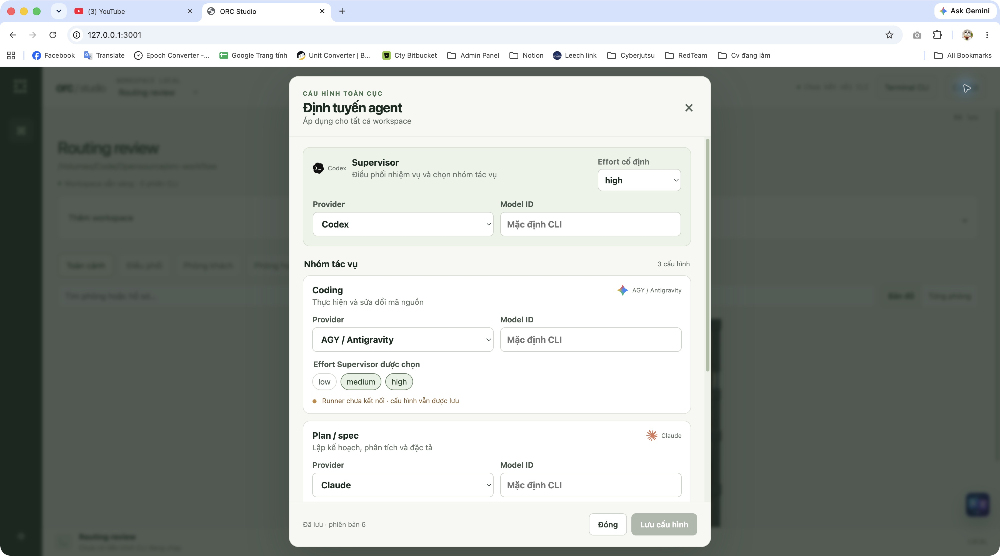
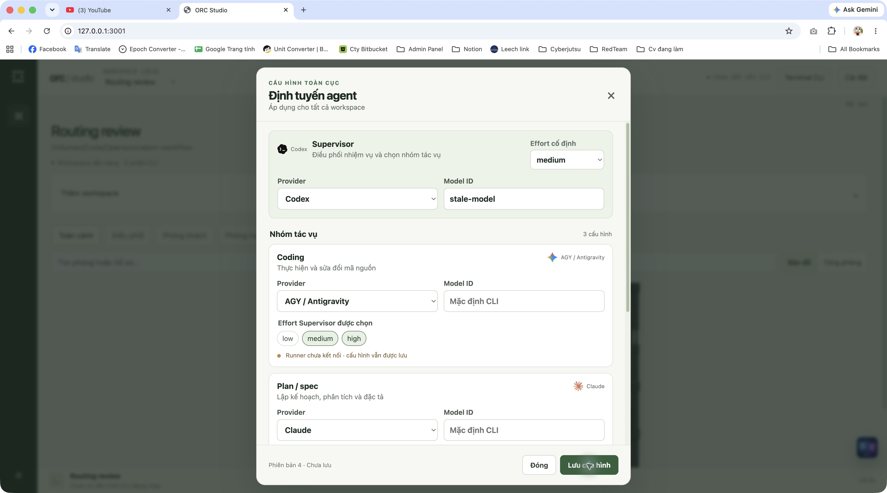
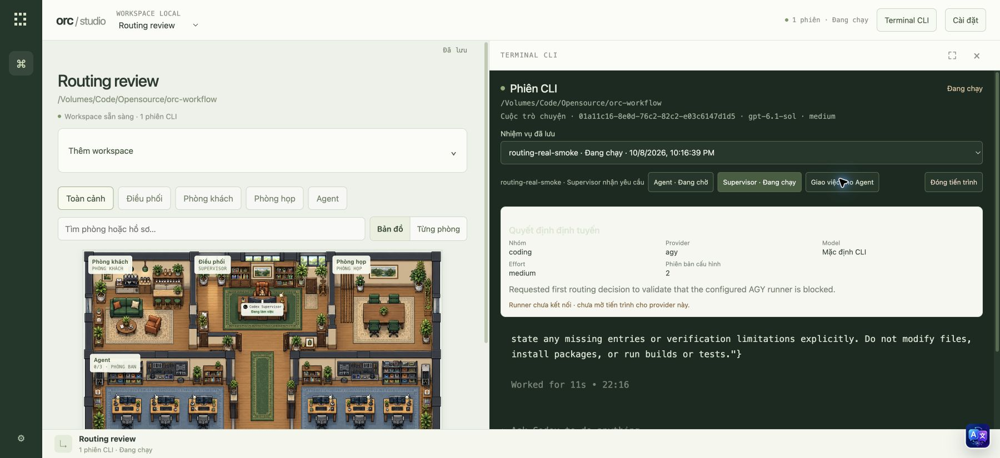
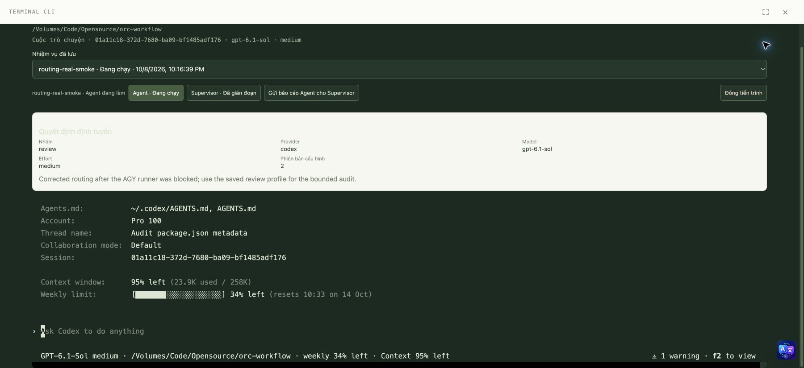
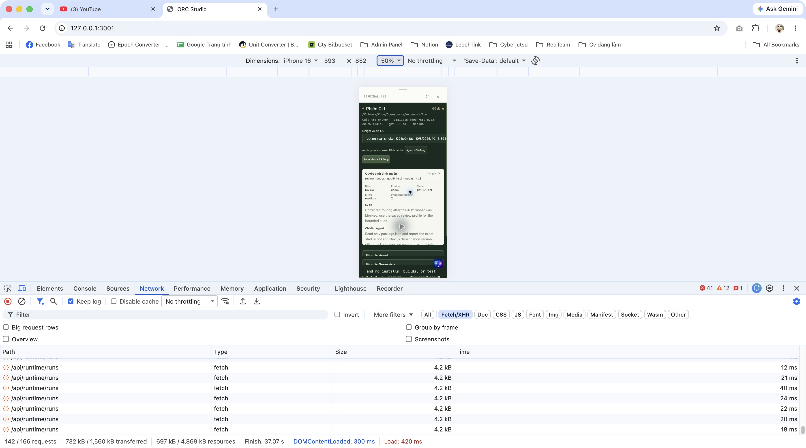
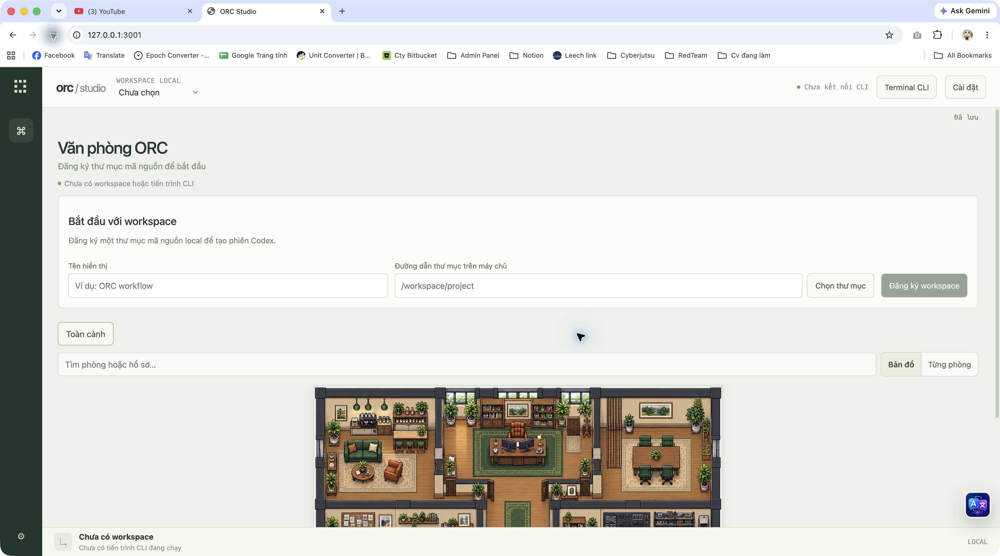
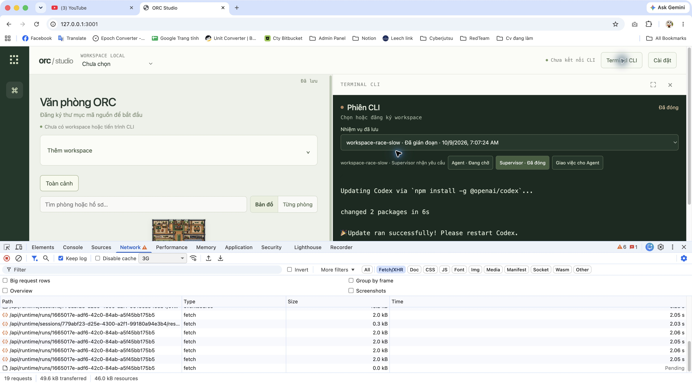
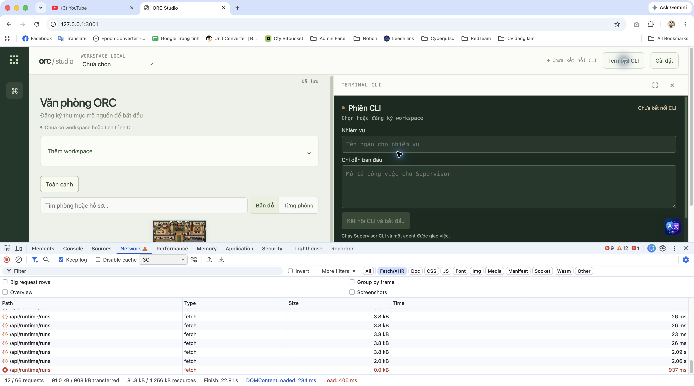
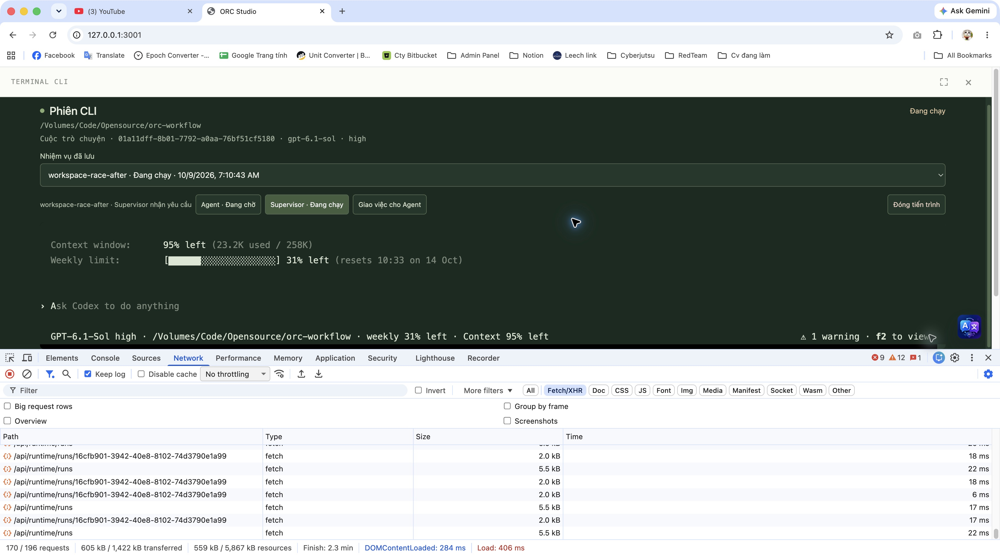

# Global agent routing validation

Luna implemented the scoped routing plan and follow-up fixes; root reviewed the source and exercised the production UI and native Codex workflow. Native execution was checked on 2026-10-08; final history/UI checks and cleanup were completed on 2026-10-09.

## Saved configuration

The singleton PostgreSQL configuration is revision 6 and applies to every workspace. Supervisor uses Codex with high effort. Coding uses AGY, planning uses Claude, and review uses Codex. Each task profile allows medium/high; model fields are empty to use the native CLI default. The Supervisor must return a valid task category and an effort from that profile's allowed list. Settings do not start a CLI.

GET/reopen restored the saved policy. An actual stale UI save returned a conflict after another save advanced the revision; the reload action recovered the current policy without overwriting it. First save, dirty-close handling, provider/model changes, desktop scroll and mobile footer visibility were reviewed through the UI.

## Actual native workflow

Disposable run `9f78c3b4-e084-43a4-b9c9-1042bb386aae` (`routing-real-smoke`) used two separate native conversations:

| Role | Runtime session | Native conversation UUID |
| --- | --- | --- |
| Supervisor | `ff6a0e00-2f52-423e-a497-ec72ed139f23` | `01a11c16-8e0d-76c2-82c2-e03c6147d1d5` |
| Peer | `cb21288b-7af6-4146-b68f-a0a3811a29f8` | `01a11c18-372d-7680-ba09-bf1485adf176` |

The initial coding/medium decision persisted the AGY choice but blocked its unsupported runner. The queued peer had no PID, UUID or confirmed process; Supervisor remained available for correction. The corrected review/medium decision started the actual Codex peer. The original test instruction initially elicited another routing JSON from the peer; a visible clarification in that same peer terminal requested the actual bounded audit before its report was accepted.

The peer read only `package.json` and reported `start: next start` at line 12 and the Next.js dependency `16.4.0` at line 25, explicitly stating that the installed version was not verified. Supervisor received and summarized that same report. No project modification, installation, build or test was part of the native task.

## Interruption and immutable choices

The run captured policy revision 2, with explicit `gpt-6.1-sol` and medium effort. During the unfinished task, the global review profile was changed to high-only at revision 3. An intentional SIGKILL targeted only the owned Next preview process (PID 11739); the watchdog terminated its owned CLI children. Restart restored interrupted sessions without creating office actors.

The first real resume exposed a duplicated `resume UUID` in the launch arguments. Luna removed the duplicate, and root resumed the existing peer UUID successfully. OS arguments and native `/status` confirmed `gpt-6.1-sol` / medium, preserving the run's saved choice despite the changed global policy. Supervisor also resumed its original UUID. An integration regression separately checks that resuming an unfinished Supervisor delegation uses the saved routing JSON instruction rather than the legacy free-text instruction.

After the UI report handoff and finalization, the run had status/phase `done`; both sessions were closed with exit code 0, null PIDs and `processConfirmed: false`. OS checks showed the two owned resumed processes (78573 and 83290) absent.

## Final UI defects and checks

Root caught a collapsed desktop settings content area, a routing summary shrinking inside terminal flex layout, insufficient summary contrast, and closed-history replay applying old active/error states to the current closed session. Luna corrected these issues. The terminal still renders every saved output event, but status/error events at or before the authoritative attach sequence cannot replace current session state. Input and resize require an active, confirmed native process; a history SSE connection alone cannot show a running CLI.

The rebuilt production preview loaded the completed Supervisor history on mobile at 393×852: closed status and native UUID/model/effort stayed visible, input keys were disabled, and replay did not display the earlier false input-confirmation error. The routing decision is collapsed by default; expanded content is bounded and scrollable. Desktop settings restored the final revision 6 defaults with visible Close/Save controls. Earlier mobile settings checks covered 390×844 and 390×600.

Final root gates: **88 tests across 19 files passed**, production build including TypeScript passed, and `git diff --check` passed. PostgreSQL integration checks use the dedicated test database; native boundary methods are stubbed in those tests. The browser/native observations above are separate real execution evidence, not a claim that the test suite runs all CLIs.

## Clean handoff and limits

Root stopped the preview and transactionally removed only the completed routing test run, its two sessions/events, the `routing-review` workspace and empty operational projection. Global routing revision 6, migrations, provider authentication and native conversation histories were preserved. After restart, runtime APIs returned empty workspaces/runs and the browser showed no workspace or CLI process. Preview: `http://127.0.0.1:3001/`.

Only the Codex native runner is connected. AGY, Claude and OpenCode can be configured but cannot launch through ORC yet; unsupported choices never fall back silently. This remains a local, manually advanced Supervisor → Peer → Supervisor workflow, without automatic Lead orchestration or public customer authentication/RBAC. Application-process interruption was tested; full machine power loss and PostgreSQL crash recovery were not established by this routing check. Native provider histories and repository files require persistent storage alongside the database. Earlier network-disconnect evidence is documented in [native runtime validation](orc-native-runtime.md).

## Follow-up: workspace boundary race (2026-10-09)

The user's completion check prompted a bounded additional review. Root reproduced an actual late-response bug with Chrome's 3G network throttling: start a real Codex task in `workspace-switch-check`, select no workspace while its POST is pending, then reopen the terminal. The old response arrived after approximately two seconds and displayed that workspace's running Supervisor and writable terminal under “Chưa chọn”. A normal-speed first attempt finished too quickly to reproduce it; the delayed case is the failure evidence.

Luna scoped terminal instances and callbacks to a workspace generation, filtered history by the selected workspace, guarded async completion/error handling against disposal and changed selection, and retained another session's blocked-input warning when resuming a different session. Deferred regressions cover current results being accepted, A→B→A rejecting an old result, and component disposal rejecting a late result. Root reviewed the source and the rebuilt production UI.

Repeating the same actual 3G scenario with run `16cfb901-3942-40e8-8102-74d3790e1a99` returned its POST after 2.06 seconds while the no-workspace terminal stayed empty. Returning to the original workspace and clicking its actual Supervisor restored native UUID `01a11dff-8b01-7792-a0aa-76bf51cf5180`, model `gpt-6.1-sol`, high effort; native `/status` pasted into the terminal worked. No peer was started in this scope check.

Root also caught the shell displaying “1 phiên · Chưa kết nối CLI” after workspace hydration before a terminal run was selected. The count and status now use confirmed native sessions in the selected workspace. A final build and exact-UUID resume restored the same Supervisor: API showed active PID 39551, while the browser showed “1 phiên · Đang chạy” with the terminal panel unselected. Selecting no workspace cleared its count without closing the actual task. Closing it afterward left a null PID, and the OS process was absent.

Three disposable scope-check tasks were removed only after their processes stopped; the final task was deliberately closed unfinished rather than marked done. Routing revision 6 and native histories were retained. Browser throttling was restored to “No throttling”. Final follow-up gates: **91 tests / 19 files passed**, production build including TypeScript passed, and whitespace checks passed.
