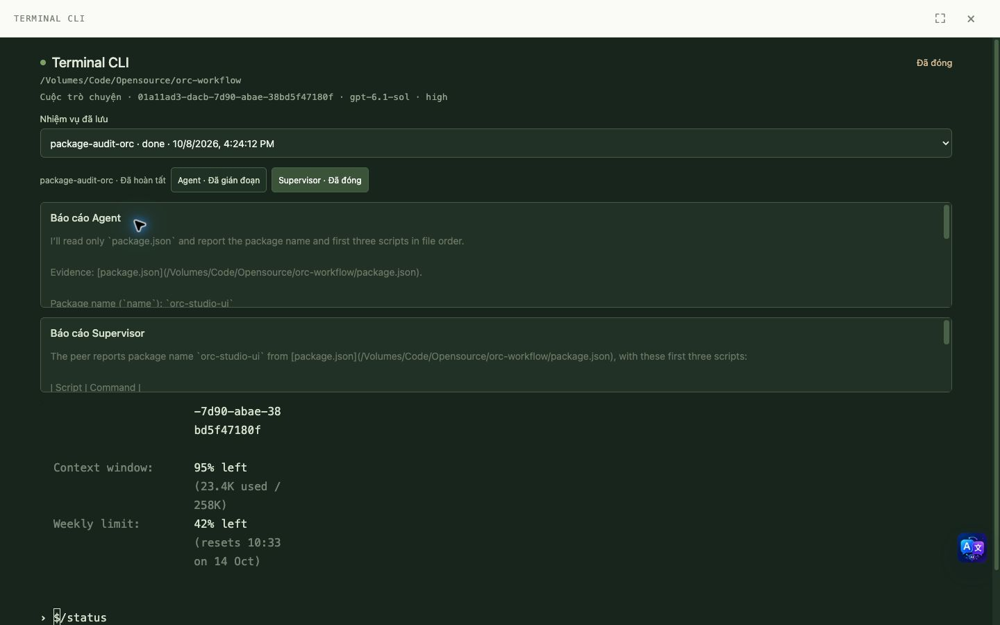
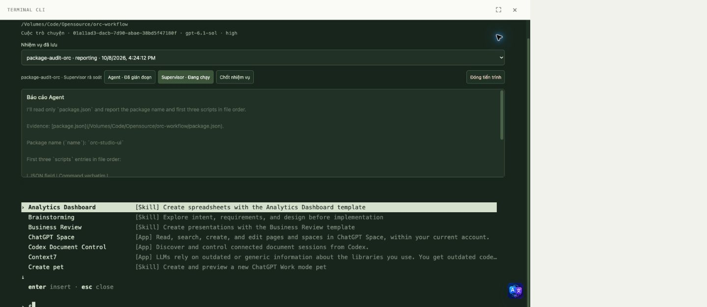
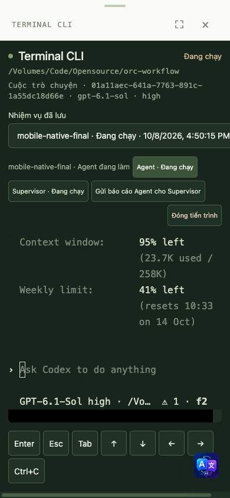
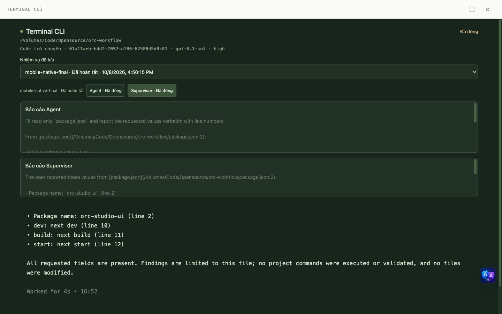
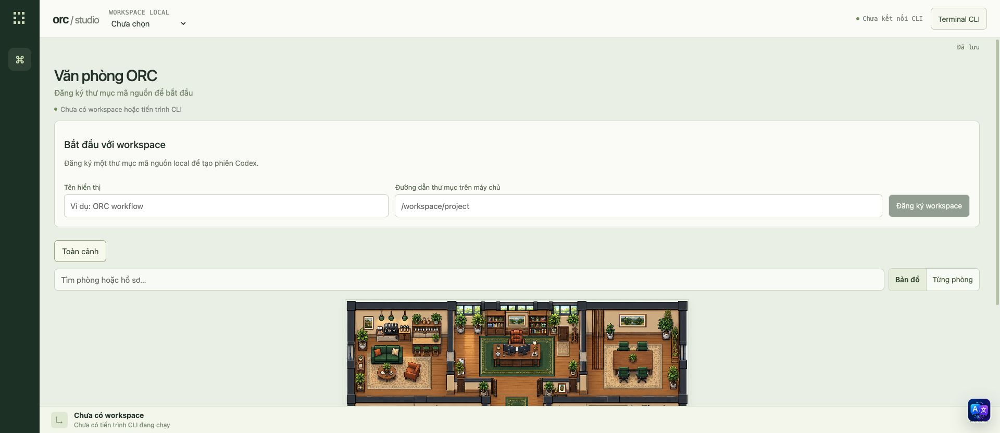
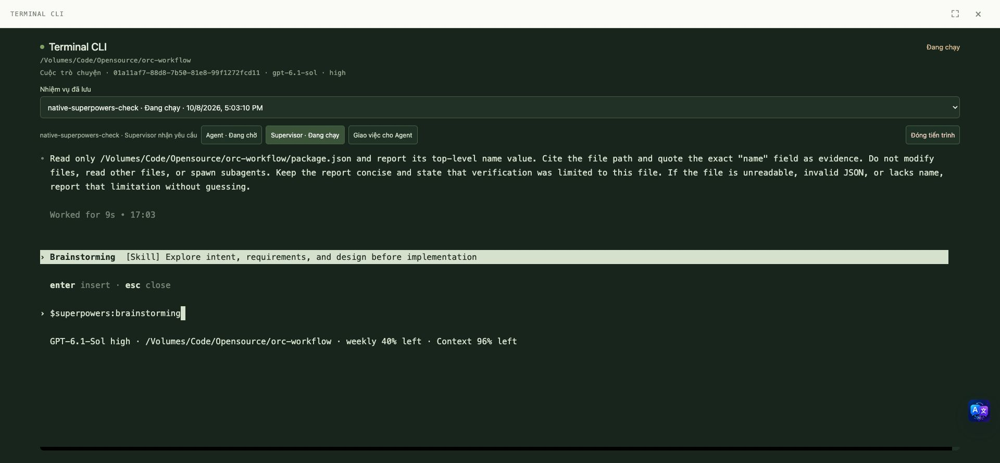
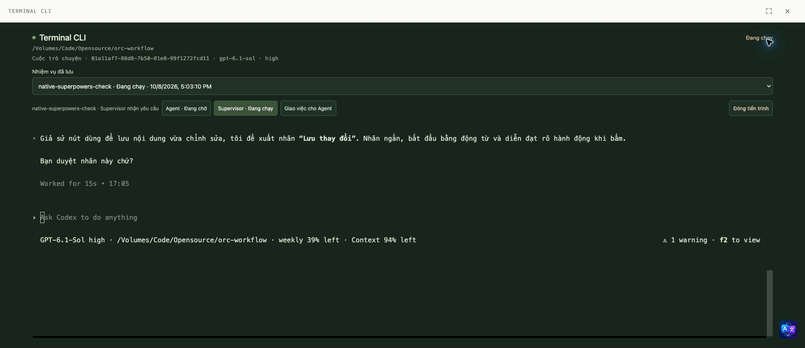
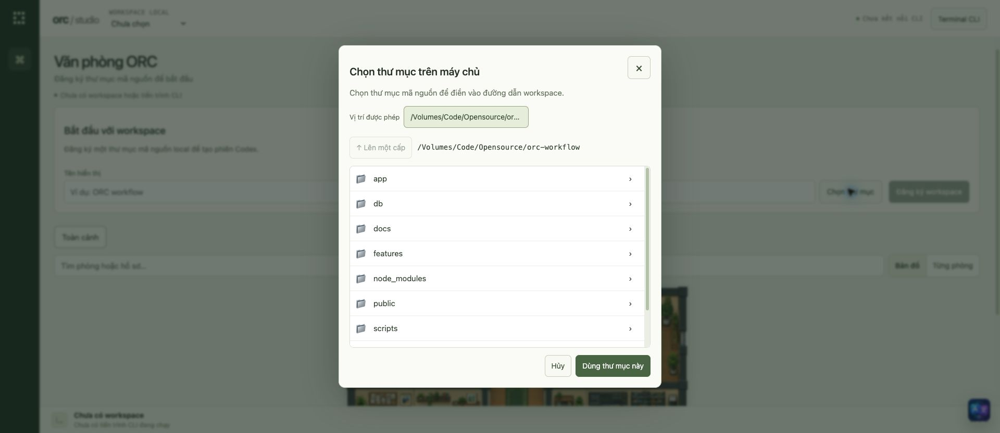
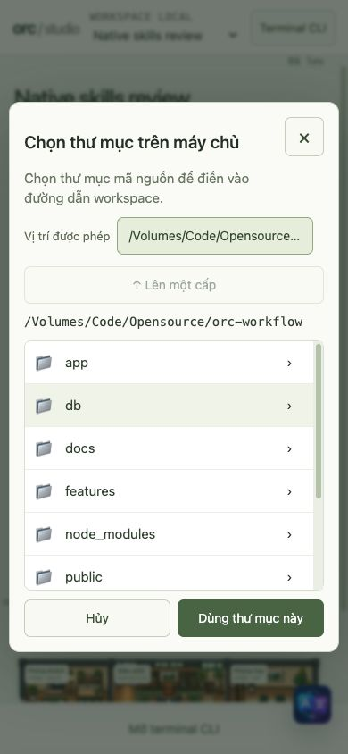

# Native runtime validation

Scope approved by the user on 2026-10-08: remove operational mock data, clear the application's PostgreSQL data, connect a native CLI, run a lightweight supervisor/peer task through the web UI, and test server interruption and network loss. Luna owns implementation and fixes; the root agent reviews and performs the final real-world checks.

## Reset performed before testing

The production preview was stopped before each reset. After the native-runtime migration, `studio_snapshot`, `studio_event`, `cli_conversation_reference`, `runtime_workspace`, `runtime_run`, `runtime_session`, and `runtime_event` were truncated in both `orc_studio` and the dedicated `orc_studio_test` database. The second reset at approximately 09:10 UTC returned zero for all seven tables in both databases. Schema, migrations, unrelated databases, CLI authentication and native CLI histories were preserved.

The first native attempt exposed a bootstrap defect: app-server `thread/start` returned an unused UUID, but the native TUI subsequently failed with `No saved session found`. The initial short probe had only reached `Resuming session` and was insufficient evidence. The failed test rows were removed in the second reset; this document preserves the failure. Recovery testing requires a genuinely persisted native conversation and full visible terminal execution, not an assumed UUID or a hidden first task.

A separate root reviewer probe at approximately 09:12 UTC proved the replacement mechanism: start a fresh native TUI, capture its exact `Session:` UUID through `/status`, paste a bounded no-tool prompt into that terminal, observe `ORC_NATIVE_BOOTSTRAP_OK` from an actual completed assistant turn, stop it, then run `codex resume` with that same UUID. After eight seconds the native process remained alive, restored both the original prompt and answer, and did not report a missing session. This is provider bootstrap evidence only; it does not establish the application's full workflow or server/network recovery checks below.

## Acceptance checks

| Case | Required observation | Result |
| --- | --- | --- |
| Fresh operational UI | No seeded workspace, contract, progress or running agent; no demo/role-preview/test controls | Passed before registration; final reset recorded below |
| Real workspace | Register an existing repository; rooms contain only genuine running sessions | Passed with this repository, queued peer has no office actor |
| Native terminal | Full native terminal output, input and resize; readable desktop and mobile fullscreen | Desktop 1440×900 and mobile 390×844 passed, including native `/status` with the mobile Enter key and no document overflow |
| Supervisor → peer → supervisor | Separate native CLI conversations, genuine delegation and report, no synthetic completion | Passed for `package-audit-orc` using two native Codex UUIDs |
| Idle cleanup | Finished processes exit; reopening a panel does not spawn a CLI | Passed: finalized run is `done`, both PIDs null, zero office actors; OS process 27265 absent |
| Network disconnect | Losing the browser connection does not close the native session or duplicate work; attach restores output | Passed after SSE fix: PID 27265 and native UUID unchanged across proxy outage |
| Server interruption | Persisted task remains unfinished; resume uses the same native conversation UUID, never `--last` or a fresh replacement | Passed across three abrupt Next process kills, including an unfinished native final-report turn |
| Isolation from fixtures | Operational initializer and API never import/restore the test fixture | Passed source review: UI and persistence default to `createEmptyState`; fixtures remain test inputs only |
| Gates | Fresh unit/integration tests, typecheck and production build | Final root run: 66 tests / 14 files passed with PostgreSQL access at 09:49 UTC; typecheck, migration status and production build passed |

## Real workflow and interruption evidence

The read-only task inspected `package.json` and reported `orc-studio-ui` plus exactly `dev: next dev`, `build: next build`, and `start: next start`. No project scripts or modifications were authorized. Run `d4fe63a9-2e69-4711-81e7-eb5022af802e` used Supervisor UUID `01a11ad3-dacb-7d90-abae-38bd5f47180f` and peer UUID `01a11ad7-3e24-75c0-9f3b-a298753b7afe`, both with the native `gpt-6.1-sol` / high settings. Separate native history supplied delegation, peer evidence, and the final Supervisor summary. At 09:42:24 UTC the UI finalized the genuine completed summary and closed the remaining native process; the report and task were persisted before final cleanup.

Three deliberate SIGKILLs targeted only the preview's Next process:

1. Next PID 79047 died while the ORC task remained in Supervisor delegation. Its CLI process exited through the watchdog. Resume used the original Supervisor UUID and restored its instruction.
2. Next PID 94489 died after the peer had completed its first turn but before handing its report to Supervisor. Both CLI children exited. Both resumed with their original UUIDs; completed peer evidence survived. This was an unfinished workflow test, not an unfinished peer-model-turn test.
3. Next PID 6430 died at approximately 09:32:19 UTC during the Supervisor's final report. PostgreSQL already held the peer report and delivered checkpoint, but no final report. The native history had `task_started` at 09:32:16.613 and no matching `task_complete` before the kill. On restart, the UI showed interrupted sessions and retained the report. Resuming the same Supervisor UUID created PID 27265 and completed a concise summary from the previous peer evidence. It did not create a new conversation or redo the peer task.

For network testing, a local reverse proxy destroyed browser connections while leaving the server and PTY running. After the SSE fix, the UI disabled terminal input and showed recovery while Supervisor PID 27265 / UUID remained unchanged. Reconnection replayed ordered events; `/status` and `/skills` worked through the web terminal afterward. The native skills list displayed the CLI's installed skills and connected apps; it was not a synthetic ORC list.

## Defects found and reviewed

- Replaced unusable app-server-only UUID bootstrap with the actual native TUI `/status` capture before submitting the initial prompt. All task output and tool calls remain visible in the same terminal.
- Tightened Supervisor delegation so it returns a bounded instruction instead of launching hidden native subagents. An earlier run that violated the intended ORC split was closed and excluded from acceptance.
- Fixed live SSE stalling after its initial backlog was exhausted. The pending reader now keeps polling until output or a heartbeat exists. Regression tests cover delayed output, abort, and cancellation during an in-flight database poll.
- Corrected ordered terminal input, replay beyond a single event page, session selection, native Escape behavior, process-confirmed office actors, model/effort display, terminal contrast, and mobile keybar layout. Luna implemented fixes; root exercised the production preview and reviewed the changes.
- Actual mobile testing exposed a wrapped UUID in `/status`; the old parser timed out before sending the peer task. The replacement bounds extraction to the Session field, supports terminal line wraps, and also captures wrapped model/effort. Failed bootstrap clears its PID. A subsequent mobile Supervisor and peer both captured their actual UUID/model/effort successfully.
- Reload previously omitted completed tasks and work rooms until terminal history was selected. Workspace-scoped run hydration now restores the office and progress without starting a process. Root verified reload with the panel closed showed the persisted work room, zero running actors and 1/3 completed tasks. Status polling also refreshed the peer model/effort while its panel was closed.
- Root review caught the report-motion guard still using the old task-title key after changing projections to run-ID keys. Fixed it and added a regression so periodic polling preserves completed report motion instead of restarting it every two seconds.

## Final mobile workflow and clean handoff

After the final 09:49 UTC production build, run `00c396b1-6daa-4376-a6e2-7a361c46394f` (`mobile-native-final`) exercised the whole flow from a 390×844 viewport. Supervisor UUID `01a11aeb-b4d2-7052-a186-62588d5d8c81` and peer UUID `01a11aec-641a-7763-891c-1a55dc18d66e` both bootstrapped successfully, retaining `gpt-6.1-sol` / high. The peer read the actual file, reported the requested fields and line numbers, and Supervisor summarized that same report. The mobile Enter button executed native `/status`. Finalization persisted both reports and marked the run done; both sessions became closed with null PIDs and `processConfirmed: false`. OS checks confirmed PIDs 5348 and 9549 were absent. The office showed zero live sessions and updated progress to 2/4 including the two earlier failed/interrupted test attempts.

At approximately 09:54 UTC, after closing all test sessions and stopping both preview and network proxy, all seven application data tables were truncated again in both `orc_studio` and `orc_studio_test`. The returned counts were zero for every table in both databases. This removes actual test runs as well as old mock data; evidence is preserved here and in screenshots. The preview was restarted on `http://127.0.0.1:3001/`. Its first load creates only the empty operational snapshot; workspaces, tasks, records, contracts, native runtime sessions and runtime events remain empty. CLI authentication and provider history files were preserved.

Root verified the final loaded database: all six other application tables had zero rows and `studio_snapshot` had exactly one row. The operational API returned zero workspaces, tasks, records, reports, sessions, archives and rooms. The browser displayed “Chưa có workspace hoặc tiến trình CLI”, without restored fixtures.

## Native Superpowers invocation and server directory picker

Additional root review on 2026-10-08, approximately 10:03–10:16 UTC:

- Run `ae85cfa5-7eb5-4b17-ae7c-c138a506b921` (`native-superpowers-check`) used native Supervisor UUID `01a11af7-88d8-7b50-81e8-99f1272fcd11`, `gpt-6.1-sol` / high. Typing `$superpowers` in the actual web terminal opened Codex's native skill suggestions; `$superpowers:brainstorming` narrowed the menu to Brainstorming. Enter inserted the skill selection before the bounded prompt was submitted.
- The explicit skill prompt requested a two-sentence button-label brainstorm followed by an approval question, with no file changes or agent creation. Native history for this exact UUID contained the explicit mention and injected Brainstorming skill body. The completed assistant response proposed “Lưu thay đổi” and asked for approval. This proves discovery and a bounded native skill invocation through the web terminal; it does not prove the entire Superpowers development workflow or an automatic ORC handoff. The queued peer never started.
- The Supervisor was closed through the UI. Its operational session had status `closed`, null PID, exit code 0 and `processConfirmed: false`. The unfinished compatibility task remained interrupted rather than being falsely marked completed.
- Claude's enabled Superpowers plugin was inventoried, but its bounded native invocation stopped with `Not logged in`. The initial inventory did not resolve a binary named `gemini`; the user subsequently clarified that their tool is the installed Antigravity CLI `agy` (see correction below). OpenCode's initial inventory failed with a generic `Unexpected error`; neither successful invocation nor authentication was established by that probe. These native probes do not validate other providers on the web. See the [provider compatibility audit](../research/cli-skills-compatibility.md).

The new **Chọn thư mục** control browses directories on the server, using the same allowed-root and canonical-path policy as workspace registration. Root exercised the production preview for nested navigation, returning to the allowed root, empty folders, selection filling the path, cancellation preserving the previous path, and Escape restoring focus. Both the initial registration form and the add-workspace form were checked. Selecting a directory alone creates no workspace or native process.

Real HTTP checks returned `200` and `Cache-Control: no-store` for the permitted root, `403 workspace_path_outside_allowed_roots` for `/private/tmp`, `404 workspace_directory_not_found` for a missing child, and `403 local_runtime_only` for a non-loopback Host. Unit tests separately cover hidden entries, symlink escapes and the bounded 200-directory response.

Root caught a mobile styling defect at 390×844: the close button inherited the registration form's full-width rule and squeezed the header text. Luna fixed the dialog's style isolation and sizing; root re-tested the production build at 390×844 and 390×600. The close button was 44px wide, the footer stayed inside both viewports, and document width remained 390px. Desktop remained centered with a scrollable directory list.

Final root gates after the correction: **74 tests / 16 files passed** with PostgreSQL access at 10:13:36 UTC; typecheck, production build and `git diff --check` passed. At approximately 10:15 UTC the preview was stopped and all seven application tables were cleared again in both local databases; every returned count was zero. After reopening the clean preview, root confirmed zero runs and workspaces through the runtime API, zero rows in the six other application tables, and one empty operational snapshot. CLI authentication and native histories were preserved. The directory selection in the final browser form remains unsaved and has not started a CLI.

## Provider identification correction

At the user's correction on 2026-10-08, the review switched from checking the separately named `gemini` binary to the actual requested executable **`agy`**. Safe launcher/help inspection identified Antigravity CLI `1.3.1`, with interactive TUI, model/effort and conversation-targeting options. Current official Antigravity documentation describes `/skills`. Two bounded native PTY launches, in `/private/tmp` and the existing repository, stopped at a folder-trust gate. Both selected “No, exit”, changed no trust settings and left no owned `agy` process. This identifies the installed tool; it does not prove a live skill menu, model turn or web adapter.

The user also specified OpenCode's native **`/skills`** menu. The earlier `debug skill` inventory was insufficient to establish the state of that interactive menu. Subsequent TUI observations are recorded in the compatibility audit; do not interpret the failed inventory as proof that OpenCode has no skills.

## Limits of this validation

This is a local Codex prototype with one Supervisor and one peer, and explicit UI handoff actions. Claude, Gemini, OpenCode, automatic Lead orchestration and public authenticated customer access are not implemented. The runtime rejects remote origins and out-of-root workspaces. Do not expose these experimental endpoints publicly as a production multi-tenant service.

Abrupt application-process death and browser network loss were tested. Full OS power loss, PostgreSQL crash recovery, disk failure, provider outage and every approval/tool failure were not exhaustively tested. Native provider histories and repository files still need persistent volumes alongside PostgreSQL; database rows alone cannot reconstruct a missing provider history.
